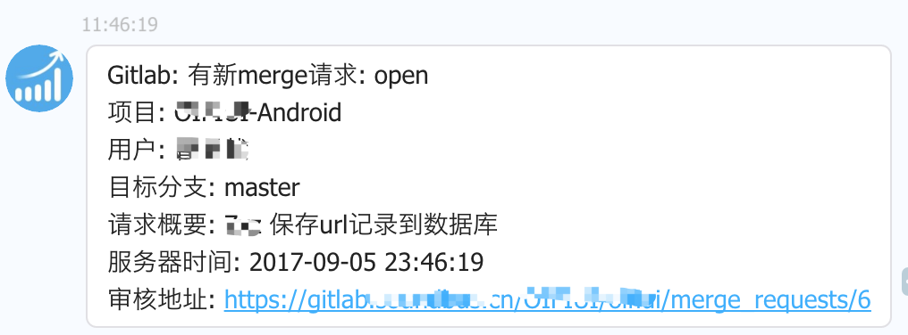
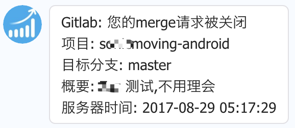
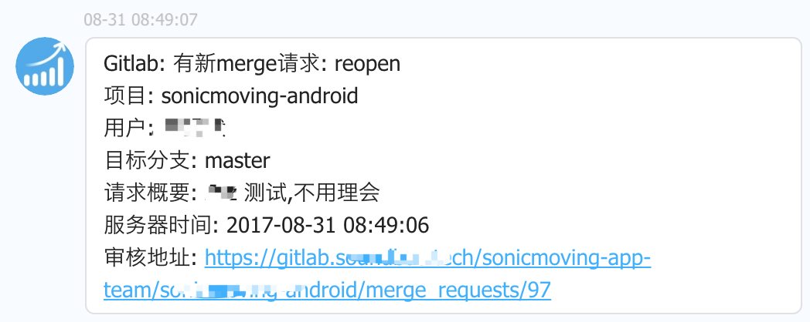
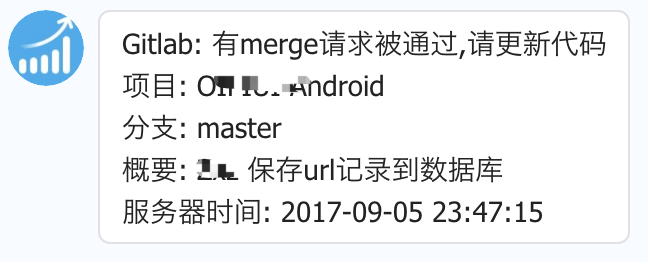
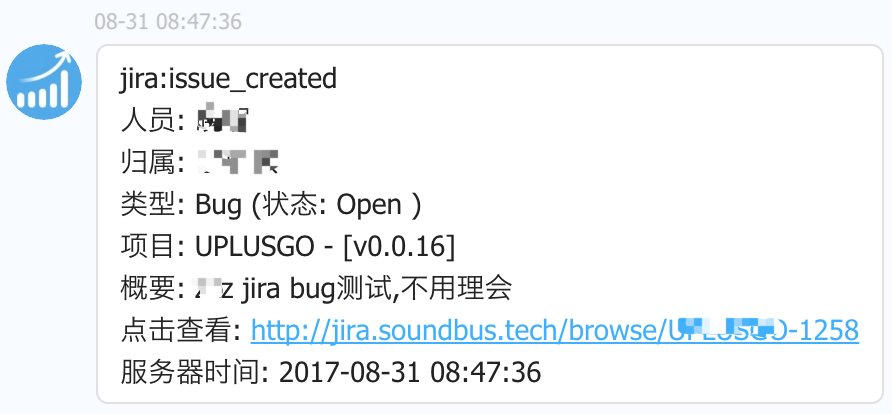
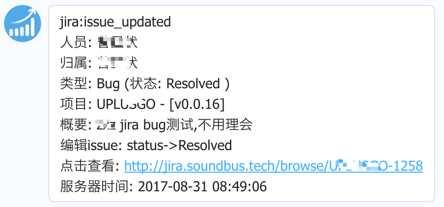
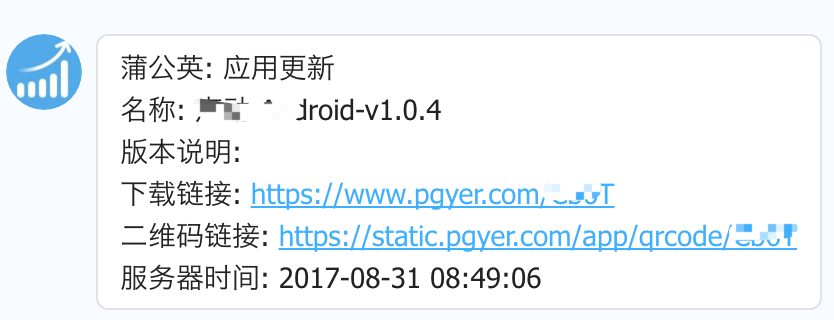

> 使用Gradle和Kotlin重写一下之前 [钉钉通知服务器](https://github.com/lucid-lynxz/Webhook_server) 顺便再熟悉下服务端基本编写操作

### 1. 配置 `config.properties` 文件参数
clone项目后,请在项目根目录下创建 `src/main/webapp/config.properties` 并设置如下属性值,以便获取钉钉相关参数
```properties
# 必填,企业在钉钉中的标识，每个企业拥有一个唯一的CorpID
corpid=dingaa******c2f4657eb6378f
# 必填,企业每个应用的凭证密钥
corpsecret=Bp1_HoQej2s******LE7aRWaJm_lYpSMYvVQi-_Q
# 必填,钉钉微应用id
agentId=123456

# 可选,gitlab默认通知审核的人员或者gira默认通知的bug归属人的真实名字,用于匹配钉钉通讯录获取userId
# 同时也是蒲公英上传应用后回调通知的默认用户
defaultNoticeUserName="张三"
# 可选,jira 详情面板网址前缀(带斜杠),其后添加jira bugId接口拼接成完整地址,若无请放空
jira_borwse_url=http://jira.soundbus.tech/browse/
# gitlab合并的目标分支是该分支时, 此hook请求才需要发送钉钉消息,不填的话,默认master
gitlab_push_merge_branch=master
```

### 2. 通讯录规则
在通讯录root部门中添加所有人,以便发送消息到特定用户时可以从root部门中查询得到用户id;
根据gitlab项目路径配置各项目部门,比如:
* gitlab项目地址为: https://gitlab.lynxz.org/demo-android/detail-android
  则表示项目名称(`name`) 为: `detail-android` ,项目所在空间(`namespace`)为: `demo-android`
* 在钉钉后台通讯录中需要先创建部门: `detail_android` ,然后创建其子部门 `demo_android`
  注意: 由于钉钉部门名称不允许使用 `-`,因此创建时改为 `_` 替代
* 目前只支持两级部门结构,若有多个部门符合上述规则gitlab merge通过时会通知所有匹配的部门成员;

### 3. 功能url
1. `{serverHost}/action/refreshToken` 重新刷新access_token,并重新获取通讯录
2. `{serverHost}/action/updateDepartmentInfo` 请求该url会立即重新获取钉钉通讯录信息,用于用户更新了钉钉通讯录后主动触发服务器刷新数据

### 4. 效果介绍
#### 1. gitlab相关





#### 2. jira相关



#### 3. 蒲公英

